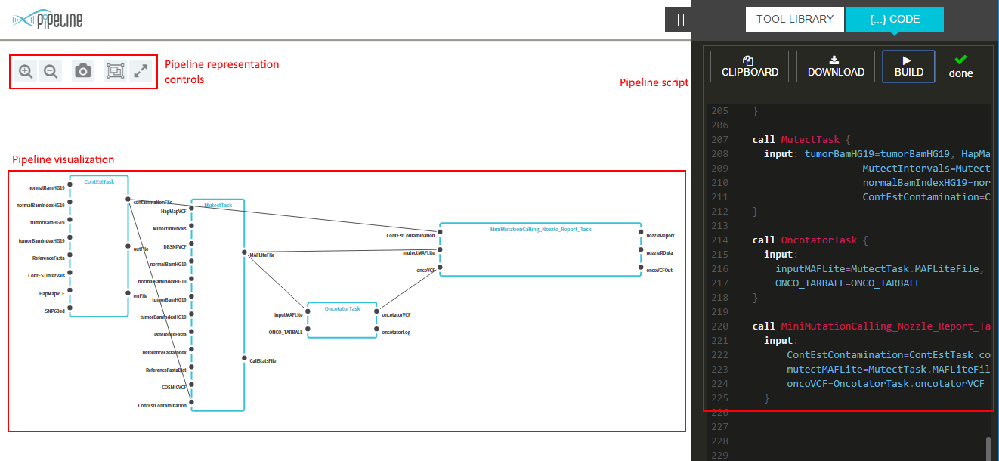

# Pipeline Builder demo application

## Detailed scenarios

* [Visualize existing WDL script](demo-app-build-wdl.md)
* [Edit a pipeline representation](demo-app-edit-visual.md)

## Demo application GUI overview

Demo app GUI consists of the following sections

* `Pipeline script` toolbar - allows to edit a script text (with a WDL syntax highlight) and build a visual representation of a script
    * `Clipboard` button - copies current script to a clipboard
    * `Download` button - downloads current script to a local folder
    * `Build` button - creates visual representation of a current script

* `Pipeline visualization` canvas - provides a visualization and editing capabilities for a Pipeline in a form of a graph
    * Each node represents a call in a WDL workflow
    * Each edge represents a link between calls

* `Pipeline representation controls` toolbar - provides basic manipulations on a pipeline visualization
    * `Zoom in/out` buttons - scale a pipeline representation
    * `Screenshot` button - creates a *png* file from current pipeline representation
    * `Autolayot` button - layouts a pipeline representation to minimize edges/nodes intersections
    * `Fit to screen` button - scales and centers a pipeline representation to optimally fill available canvas space

