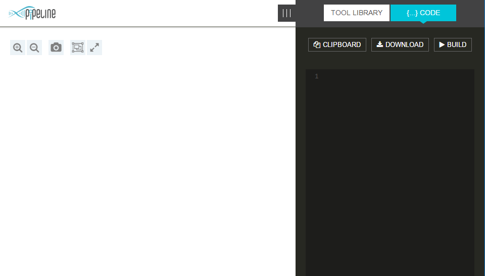
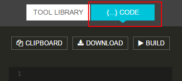
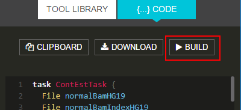
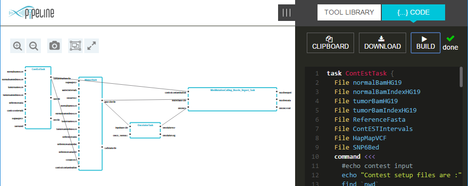

# Visualizing existing WDL script

When an application is loaded for the first time - no pipeline visual representation will be shown, as no WDL script is loaded

To visualize a graph the following operations should be performed
* Load [http://pb.opensource.epam.com](http://pb.opensource.epam.com) into a web-browser. A blank canvas will be shown

* Select `Code` tab in a `Pipeline script` toolbar

* Type or paste a WDL script into a text editor

* Click `Build` button

* `Pipeline visualization` canvas will show an appropriate graph (if a WDL script contains any issues - an error message will be shown)

