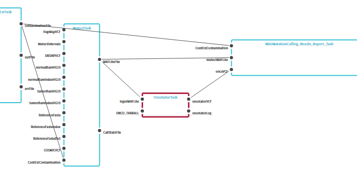
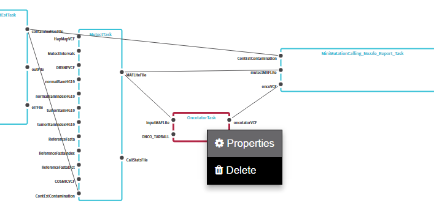
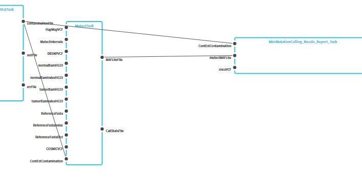
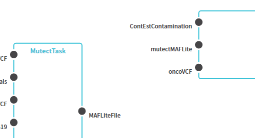
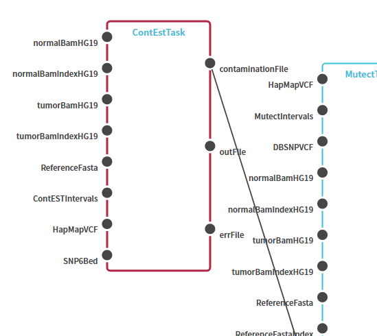
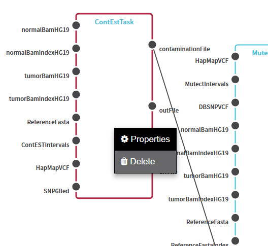
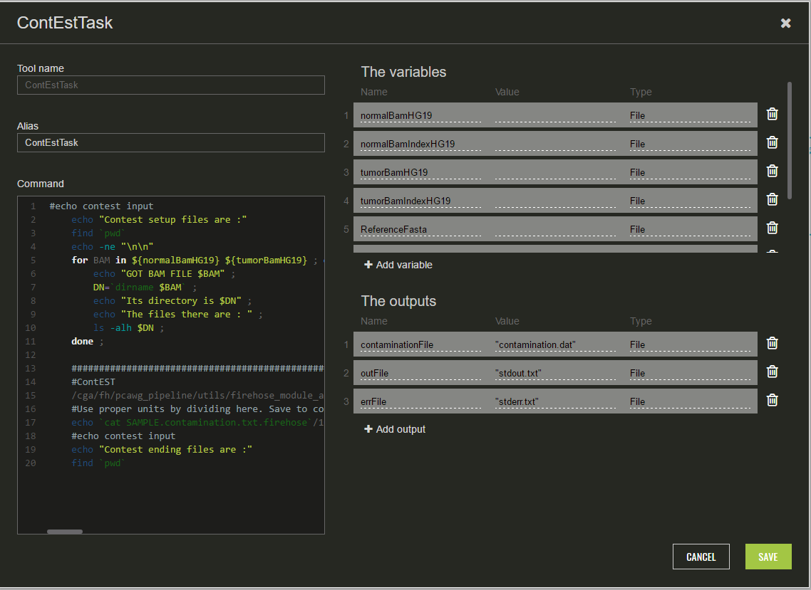

## Editing a pipeline representation

To edit a built pipeline visual representation the following operations are supported
* Delete a node (`call`)
    * Select one or more nodes by clicking them with a left mouse button - selected nodes will be highlighted (multiple selection is performed via *Shift+LMB*)
    
    

    * Click right mouse button and select *Delete* from a context menu

    

    * Nodes will be deleted
    * `Call` objects from a WDL script will be deleted as well

    

* Delete an edge (`link`)
    * Hover an edge with a mouse - *cross* icon will be shown above an edge
    
    

    * Click that icon with a left mouse button
    * Edge will be deleted
    * `Link` object from a WDL script will be deleted as well

    

* Modify node properties (`task`)
    * Select a node by clicking it with a left mouse button

    

    * Click right mouse button and select *Properties* from a context menu

    

    * A popup with a node details will be shown
    
    

    * The following properties can changed via a *Properties* popup
        * `Call` alias
        * `Task` command text
        * `Task`'s variables
        * `Task`'s outputs
    * If any of the properties is edited and saved - those changes will be reflected in a visual representation and WDL script as well
