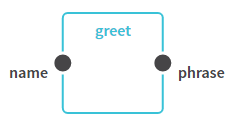

# Hello, World!

Let's start with a simple parametrized workflow which takes a name as a parameter
and prints a greeting.



## WDL Version

Here's an example implementation using Workflow Description Language.

_hello.wdl_

```wdl
task greet {
  String name

  command {
    echo 'Hello, ${name}!'
  }
  output {
    String phrase = read_string(stdout())
  }
}

workflow hello {
  String name = "World"

  call greet {
    input:
      name=name
  }
  output {
    String phrase = greet.phrase
  }
}
```

You could create such a workflow programmatically with the following code:

_hello-wdl.js_

```js
const greet = new Step('greet', {
  i: {
    name: {
      type: 'String',
    },
  },
  o: {
    phrase: {
      type: 'String',
      default: 'read_string(stdout())',
    },  
  },
  data: {
    command: 'echo \'Hello, ${name}!\'',
  },
});

const hello = new Workflow('hello', {
  i: {
    name: {
      type: 'String',
      default: '"World"',
    },
  },
  o: {
    phrase: {
      type: 'File',
    },
  },
});

hello.add(greet);

greet.i.name.bind(hello.i.name);
hello.o.phrase.bind(greet.o.phrase);
```

## CWL Version

Almost the same example could be expressed with Common Workflow Language.

_greet.cwl_

```yaml
cwlVersion: v1.0
class: CommandLineTool
baseCommand: echo
arguments:
  - $('Hello, ' + inputs.name)
inputs:
  name: string
outputs:
  phrase: stdout
```

_hello.cwl_

```yaml
cwlVersion: v1.0
class: Workflow
inputs:
  name:
    type: string
    default: "World"
outputs:
  phrase:
    type: File
    outputSource: greet/phrase
steps:
  greet:
    run: greet.cwl
    in:
      name: name
    out: [phrase]
```

The JavaScript code would be almost the same. However there's a difference in user-defined
details (types and user data).


_hello-cwl.js_

```js
const greet = new Step('greet', {
  i: {
    name: {
      type: 'string',
    },
  },
  o: {
    phrase: {
      type: 'stdout',
    },  
  },
  data: {
    class: 'CommandLineTool',
    baseCommand: 'echo',
    arguments: [
      '$(\'Hello, \' + inputs.name)',
    ],
  },
});

const hello = new Workflow('hello', {
  i: {
    name: {
      type: 'string',
      default: '"World"',
    },
  },
  o: {
    phrase: {
      type: 'File',
    },
  },
});

hello.add(greet);

greet.i.name.bind(hello.i.name);
hello.o.phrase.bind(greet.o.phrase);
```
