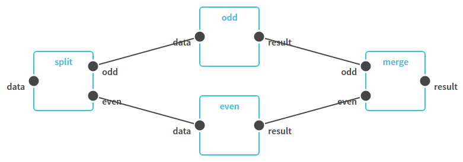

# Split and Merge



_splitmerge.wdl_

```wdl
workflow splitmerge {
  File data

  call split {
    input:
      data = data
  }
  call process as odd {
    input:
      data = split.odd
  }
  call process as even {
    input:
      data = split.even
  }
  call merge {
    input:
      odd = odd.result,
      even = even.result
  }

  output {
    File result = merge.result
  }
}

task split {
  File data

  command {
    split ${data}
  }
  output {
    File odd = "${data}.odd"
    File even = "${data}.even"
  }
}

task process {
  File data

  command {
    process ${data} -o ${data}.processed
  }
  output {
    File result = "${data}.processed"
  }
}

task merge {
  File odd
  File even

  command {
    merge ${odd} ${even} -o "merged.dat"
  }
  output {
    File result = "merged.dat"
  }
}
```

```js
const flow = new Workflow('splitmerge', {
  i: {
    data: {
      type: 'File',
    },
  },
  o: {
    result: {
      type: 'File',
    },
  },
});

const split = flow.add(new Step('split', {
  i: {
    data: {
      type: 'File',
      bind: flow.i.data,
    },
  },
  o: {
    odd: {
      type: 'File',
      default: '"${data}.odd"',
    },
    even: {
      type: 'File',
      default: '"${data}.even"',
    },
  },
  data: {
    command: 'split ${data}',
  },
}));

const process = new Action('process', {
  i: {
    data: {
      type: 'File',
    },
  },
  o: {
    result: {
      type: 'File',
      default: '"${data}.processed"',
    },
  },
  data: {
    command: 'process ${data} -o ${data}.processed',
  },
});

const odd = flow.add(new Step('odd', process, {
  i: {
    data: split.o.odd,
  },
}));

const even = flow.add(new Step('even', process, {
  i: {
    data: split.o.even,
  },
}));

const merge = flow.add(new Step('merge', {
  i: {
    odd: {
      type: 'File',
      bind: odd.o.result,
    },
    even: {
      type: 'File',
      bind: even.o.result,
    },
  },
  o: {
    result: {
      type: 'File',
      default: '"merged.dat"',
    },
  },
  data: {
    command: 'merge ${odd} ${even} -o "merged.dat"',
  },
}));

flow.o.result.bind(merge.o.result);
```
